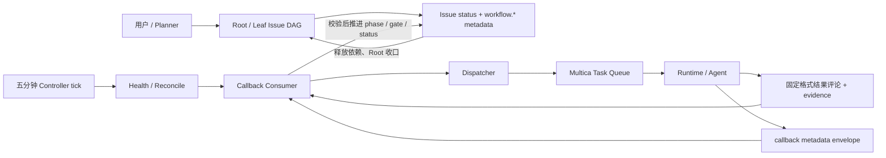

# 01｜当前架构与问题

## 1. 口径与事实来源

本文同时描述两套系统，但不把它们混为一谈：

1. **Workflow Studio 当前正式链路**：依据用户提供的 2026-08-16 事实型架构盘点。它代表现网真实使用方式。
2. **开源 Multica 当前底座**：依据 `multica-ai/multica@4d495056...` 源码。它代表本项目可以直接修改和复用的能力。

本文不会把 Studio 已有的业务设计误算成 Multica 原生能力，也不会把 Multica 已有的 Runtime/机器分发能力误算成 Studio 的设计成果。

## 2. Workflow Studio 当前正式架构

### 2.1 真实控制链



正式权威链仍是：

```text
Issue + phase + dispatch_key
→ Agent Task
→ 固定标题结果评论
→ callback_phase / callback_result_comment_id / callback_pending
→ callback_batch 校验
→ phase / gate / Issue status 推进
```

本地已经存在 ArtifactManifest、VerificationResult、NodeExecution、Diff Analyzer 和 Shadow 设计，但在提供的运行数据中尚未形成正式权威链。因此当前架构不能表述为“已经是 NodeExecution 驱动”。

### 2.2 当前事实分散在四个位置

| 事实 | 当前载体 | 当前问题 |
|---|---|---|
| 人类任务状态 | Multica Issue `status` | 粒度太粗，且有权限的 Agent 可以修改 |
| Workflow 阶段、gate、generation、callback | `issue.metadata.workflow.*` | 多字段分步写、last-writer-wins、无统一 revision |
| 结果、证据、回执 | Issue Comment | 面向人类的自然语言被迫承担机器协议 |
| 一次 Agent 执行状态 | `agent_task_queue` / Run | 只证明进程执行事实，不证明业务完成 |

这导致没有一个单独查询可以回答：

> “这个 Workflow Node 现在真实处于什么状态，为什么进入该状态，哪个 Attempt 和哪份独立验证支持这个结论？”

当前必须联合读取 Issue、metadata、Comment、Task/Run，并依赖控制器解释它们是否一致。

### 2.3 三条状态轴不能合并

```text
Issue status
    backlog / todo / in_progress / blocked / done / cancelled

Workflow phase / gate
    coding / self_test / cross_review / test_env_verify / ...
    waiting_* / running_* / done

Task status
    queued / dispatched / running / completed / failed / cancelled
```

所以以下等式全部不成立：

```text
Task completed ≠ Result valid
Result valid ≠ Verification passed
Callback consumed ≠ Phase completed
Leaf done ≠ Root acceptance passed
```

### 2.4 当前可靠性主要来自外围补偿

当前系统已经用大量工程措施降低事故概率：固定结果标题、唯一 verdict、作者与 parent 校验、generation 校验、delivery proof、写后回读、Health 恢复、Guardian、Supervisor、Bad Case 和 recovery generation。

这些措施能够证明：

> 正确的 Agent 在正确的一代任务中，按照约定格式提交了一份结果。

但仍不能单独证明：

> 结果中声称的代码、测试、环境和业务事实真实成立。

它们还引入了新的复杂度：callback 半写、重复评论、stale generation、扫描延迟、恢复逻辑和正常调度逻辑耦合，以及 Controller 版本漂移。

## 3. 开源 Multica 当前已经具备的可靠性原语

本设计不是从零重写执行平台。Multica 已经有一组可复用且经过并发场景打磨的原语。

### 3.1 Issue 是通用协作对象，不是 Workflow State Machine

`issue` 原生只有通用状态、父子关系、标签和通用依赖；metadata 后续被定义为小型 JSONB KV。

- Issue 基础表：`server/migrations/001_init.up.sql:52`
- Issue dependency：`server/migrations/001_init.up.sql:89`
- metadata：`server/migrations/105_issue_metadata.up.sql:1`
- metadata 最大 8 KiB，且仅适合小型 KV：`server/migrations/105_issue_metadata.up.sql:13`

源码中 `issue_dependency` 目前只有建表、索引和清理引用，没有发现面向运行时的创建/求值/自动释放查询。它是关系数据结构，不是完整 DAG 调度器。

### 3.2 Task Queue 已有原子 claim、序列化和终态 CAS

`agent_task_queue` 已有：

- `queued → dispatched → running → terminal` 生命周期；
- `FOR UPDATE SKIP LOCKED` 原子领取；
- 同一 Agent 在同一 Issue 上的串行化；
- Agent 并发上限；
- 完成和失败的条件更新；
- Task 级去重、重试 lineage 和 failure taxonomy。

关键源码：

- 原子 claim：`server/pkg/db/queries/agent.sql:655`
- `dispatched → running`：`server/pkg/db/queries/agent.sql:797`
- `running → completed`：`server/pkg/db/queries/agent.sql:829`
- Task claim service transaction：`server/internal/service/task.go:2919`
- CompleteTask 事务与幂等终态：`server/internal/service/task.go:3558`
- FailTask 与原子 retry child：`server/internal/service/task.go:3963`

这些能力应被复用，而不是再写一套 Studio 私有队列。

### 3.3 现有 lease 与 recovery 解决的是 Task 执行活性

Multica 目前把活性拆成两段：

1. **claim 后、StartTask 前**：`prepare_lease_expires_at`，daemon 在准备执行环境时续约；过期后可以重新投递。
2. **running 后**：依赖 `agent_runtime.last_seen_at` 和 Runtime liveness；daemon 重启或 Runtime 失联时将孤儿 Task 置失败，再进入统一 retry/failure pipeline。

关键源码：

- prepare lease migration：`server/migrations/124_task_prepare_lease.up.sql:1`
- stale dispatched reclaim：`server/pkg/db/queries/agent.sql:738`
- orphan recovery：`server/internal/handler/task_lifecycle.go:18`
- stale task 判断：`server/pkg/db/queries/agent.sql:1118`
- per-task heartbeat 曾被移除，running 活性由 Runtime 负责：`server/migrations/069_drop_task_last_heartbeat.up.sql:1`

因此 Workflow Runtime V1 不应平行复制一套“Task 是否活着”的判断。新层要解决的是 **Workflow 所有权与旧 Attempt 回写隔离**，不是替换 Runtime liveness。

### 3.4 Multica 已经使用数据库事务和幂等恢复处理真实并发窗口

源码中已有可直接沿用的设计风格：

- Issue、标签和特定 deferred Task 同事务创建：`server/internal/service/issue.go:195`
- claim response 构建失败后用 `dispatched_at` CAS 回队列：`server/internal/service/task.go:3199`
- Task fail 与 retry child 同事务：`server/internal/service/task.go:3963`
- Autopilot webhook admission 以 delivery id 唯一，冲突方读取 winner：`server/internal/service/autopilot.go:154`
- webhook delivery 使用数据库 lease 的 durable worker：`server/migrations/176_webhook_delivery_worker.up.sql:1`
- Task owner row fence 处理 teardown/merge 并发窗口：`server/migrations/284_task_owner_row_fence.up.sql:1`

这说明新增 Workflow Runtime 应遵守同一种原则：持久化先于副作用、冲突由数据库选唯一 winner、失败后基于 durable facts 恢复。

### 3.5 Stage 只是 barrier notification，不是声明式 Workflow

Multica 的 `issue.stage` 把同一父 Issue 下的子项分成有序 barrier group。某一阶段全部终态后，服务端生成系统评论并唤醒父 Issue assignee。

但后续 Stage 是否创建、哪些 backlog 子项可以转 todo、整个流程是否结束，仍由 Agent 判断。源码明确写道：

> `The server has no declarative workflow model — stages are agent-driven.`

参考：

- Stage migration：`server/migrations/123_issue_stage.up.sql:1`
- barrier 计算：`server/internal/handler/issue_child_done.go:52`
- 后续 Stage 仍由 Agent 决策：`server/internal/handler/issue_child_done.go:428`

所以 Stage 可以保留为协作 UI 能力，但不能直接充当新 Runtime 的 DAG 状态权威。

### 3.6 Task 完成刻意不推进 Issue

`TaskService.StartTask`、`CompleteTask`、`FailTask` 都明确声明：Issue status 不由 TaskService 修改，Agent 通过 CLI 管理。

参考：

- `server/internal/service/task.go:3444`
- `server/internal/service/task.go:3558`
- `server/internal/service/task.go:3963`

这在通用协作产品中是合理的，但对可信 Workflow 来说形成了核心缺口：

```text
Task Runtime 知道“进程结束了”
Workflow Studio 通过 Comment/metadata 猜“节点该不该前进”
两者之间没有结构化、事务化的桥
```

## 4. 当前架构的根因问题

### 4.1 没有统一 Workflow Source of Truth

phase、gate、generation、dispatch、结果、验证和依赖分散在不同载体。任何单项都可能先写、漏写、错写或被旧 Worker 重写。

### 4.2 Agent 同时扮演执行者、证据作者和事实裁决者

即使合同要求 Agent 不直接改正式状态，平台层没有 Workflow 字段级写隔离。一个格式完全正确的假 PASS 仍可能穿过 Legacy 格式校验。

### 4.3 正常推进依赖周期扫描

五分钟 Tick 同时承担 Health、reconcile、callback、依赖释放和派发。事件丢失或 envelope 半写后，系统只能等下一轮扫描推理世界状态。

### 4.4 并发正确性靠“唯一 Scheduler”而不是数据语义

单 Controller、`max concurrency = 1` 和外部 lease 降低竞争，但它们不能阻止：

- 重启前的旧 Worker 晚到回写；
- 两个进程同时读取旧 metadata；
- 一次多字段 callback 写到一半；
- 控制包版本漂移后不同 reducer 对同一事实给出不同解释。

### 4.5 依赖是字符串约定，不是可验证的运行时边

当前依赖主要在 metadata 中引用 Issue identifier。重命名、格式差异、stale read、错代 Issue 和人工修改都需要外围规范化与修复。

### 4.6 运行成功与业务成功没有强制隔离

当前最危险的捷径是把：

```text
Agent process exited successfully
```

逐渐解释为：

```text
代码/环境/业务验收成功
```

新架构必须在数据模型上阻止这条捷径，而不是继续依赖 Prompt 提醒。

## 5. 典型故障如何暴露架构缺口

| 故障 | 当前 Legacy 处理 | 根因 |
|---|---|---|
| Task completed，但输出是限流错误 | Health/Callback 发现没有合法结果，再建 recovery generation | Task 与 Attempt/业务结果未分层 |
| 结果评论已写，callback 漏写 | 等下一 Tick 补 journal 或重新推理 | Comment 和 callback 不是一个事务 |
| 两个 Controller 同时推进 | 依赖单实例纪律、fresh read 和外部 lease | 没有 revision CAS |
| 旧 Worker 晚到 PASS | generation/dispatch_key 校验拦截，遗漏时可能误消费 | 没有数据库 fencing token |
| Agent 提交结构合法的假 PASS | 独立 Review/Shadow 若未接管则仍有信任缺口 | 执行者与裁决者未分离 |
| 前驱完成但后继未释放 | 周期扫描修复 | 终态迁移与 dependency release 不同事务 |
| 状态已写但事件未发 | UI/监听器等待下一次刷新或补偿 | 没有事务 Outbox |
| Controller 包混装版本 | 同一事实可能由不同 reducer 解释 | 控制逻辑没有稳定版本边界 |

## 6. 对目标架构的直接约束

基于以上事实，目标架构必须满足：

1. 一个 Node 只有一个结构化 authoritative state。
2. Agent 没有 transition 权限。
3. Task terminal 与 Node terminal 必须分离。
4. 所有状态变化必须带 expected revision。
5. 旧 Attempt 即使晚到，也不能改变当前 Node。
6. Node 成功、依赖释放、Run 聚合、Event、Outbox 必须在同一事务边界内。
7. 正常路径由事件推进，reconcile 只做收敛和修复。
8. Task 执行继续复用 Multica 原生 Queue/Runtime/recovery。
9. Studio 的业务语义不能污染成 Multica 只为一个项目服务的硬编码。
10. 迁移期间不能同时存在两个正式状态写者。

下一篇文档据此划分 Studio 与 Multica 的责任边界。
