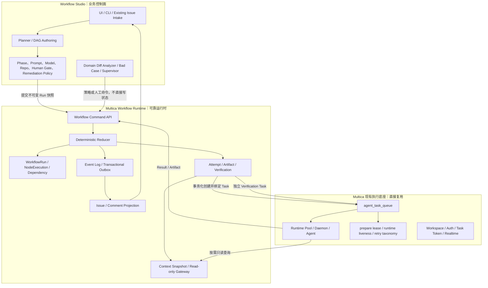

# 02｜目标架构与责任边界

## 1. 目标不是“把 Workflow Studio 搬进 Multica”

目标是把任何可靠 Agent Workflow 都会需要的 **通用运行时原语** 做进 Multica；Studio 继续保留自己的领域设计。

判断一个能力是否应该下沉，可用三个问题：

1. 它是否与 `coding / review / test` 这些具体阶段名称无关？
2. 任何长时间运行、可重试、有依赖的 Agent Workflow 是否都会遇到？
3. 如果只在 Studio 上层实现，是否仍会受制于 Issue/Comment/metadata 的写入语义？

三个答案都是“是”，才进入 Multica 核心。

## 2. 目标分层



### 2.1 三个层次

| 层 | 回答的问题 | 权威数据 |
|---|---|---|
| Studio 业务控制面 | 做什么、阶段如何定义、用谁、如何验收、何时需要人工 | Workflow Definition、Prompt、Policy 的作者态 |
| Workflow Runtime | 这次 Run 真实进行到哪里、哪个 Attempt 有效、谁有权推进、下一节点是否 Ready | WorkflowRun、NodeExecution、Attempt、Verification、Event |
| Task/Runtime 执行面 | 哪台机器和哪个 Agent 正在执行、是否失联、进程结果是什么 | agent_task_queue、Runtime、Task lifecycle |

三个层次不能互相替代：

```text
Studio Plan 不是运行事实
Task completed 不是 Node succeeded
Issue done 不是 Workflow verification
```

## 3. 能力归属矩阵

### 3.1 保留在 Workflow Studio 上层

| 能力 | 为什么留在上层 |
|---|---|
| 用户材料收集、需求澄清、DAG authoring | 产品与领域体验，不是通用执行原语 |
| `coding → self_test → cross_review → test_env_verify → diff_reason` 阶段定义 | 属于当前研发 Workflow 的业务语义 |
| Owner Profile、Agent/Model 选择、fallback 策略 | 业务路由策略会持续变化，不应硬编码进底座 |
| Prompt、Skill、代码仓库和分支策略 | 执行内容，不是状态一致性机制 |
| 验收标准生成、业务 blocker policy | 底座只执行结构化 policy，不决定具体业务标准 |
| Human Gate 的文案、审批人选择和升级路径 | 组织流程语义 |
| remediation 分类、预算和 lineage 策略 | Studio 领域策略；底座提供可实现它的 retry/child-run 原语 |
| Diff Analyzer、Bad Case、能力沉淀 | 高层诊断与演进体系 |
| 复杂 Root 风险归纳与业务报告 | 面向业务的解释与汇总 |

### 3.2 集成进 Multica Workflow Runtime

| 能力 | 为什么必须下沉 |
|---|---|
| WorkflowRun / NodeExecution | 需要统一、结构化、可事务更新的 Source of Truth |
| Dependency Edge / Ready 计算 | 必须和前驱终态在同一事务内释放，不能依赖字符串扫描 |
| ExecutionAttempt 与 Task 绑定 | 必须区分一次进程执行和节点业务结论 |
| Node revision CAS | 并发正确性应由数据库保证，而不是单 Scheduler 纪律 |
| Attempt fencing token | 旧 Worker、旧 Controller 和超时 Attempt 晚到时必须失去写权 |
| ArtifactManifest | Artifact 要可寻址、不可变、带 digest，不能只存在自然语言评论 |
| VerificationResult | 必须结构化记录验证输入、验证者、检查项和结论 |
| 独立性约束 | policy 要求时，底座阻止 executor 自验收 |
| Retry/timeout/recovery policy 执行 | 正确处理 Attempt lineage，避免 Task retry 与 Workflow retry 双重触发 |
| Workflow Event Log | 每次状态变化可解释、可重放、可审计 |
| Transactional Outbox | 状态和副作用不能出现“一个成功一个丢失” |
| Idempotency key | HTTP 重试、worker 重投和重复 callback 不得产生第二个状态变化 |
| Issue/Comment projection | 兼容现有 UI，但保证投影永远不是权威 |
| Reconciler | 根据结构化事实收敛，不再从自然语言推理世界状态 |
| Context Snapshot / Gateway | Attempt 必须看到稳定、可审计且受租户边界保护的上下文；不能由上层每次临时拼接完整历史 |

### 3.3 直接复用 Multica 已有能力

| 已有能力 | 复用方式 |
|---|---|
| Issue、parent/child、label、project | 作为用户可见的协作投影和入口 |
| `agent_task_queue` | 承载 executor/verifier 的实际 Agent Task |
| Runtime Pool 与机器分发 | 不修改其资源选择职责；Workflow 只提供 executor 目标 |
| Task claim / prepare lease / runtime recovery | 继续判断 Task 执行活性 |
| failure_reason taxonomy | 作为 Workflow retry policy 的输入 |
| Task token / daemon access | 认证 Attempt result 的实际 Task 身份 |
| Autopilot schedule/webhook | 可作为 Run 创建触发源，不充当 Workflow reducer |
| Event Bus / WebSocket | 由 Outbox publisher 驱动 UI 更新 |
| Workspace、membership、tenant guards | 所有 Workflow 表和命令继承同一租户边界 |

### 3.4 上下文工程的边界

| 层 | 负责什么 |
|---|---|
| Workflow Studio | 决定哪些资料属于当前任务、L0 需要哪些字段，以及 Agent 何时应主动查询 |
| Multica Workflow Runtime | 创建不可变 Task/Attempt 快照，维护目录、revision 和 digest，并提供 task-scoped 只读查询 |
| Agent/Daemon | 默认消费 L0；需要前置结果、历史执行、验证或产物时调用查询接口；同一 Issue 尽量复用 Session |

默认 Prompt 只注入 `task/current` 与 `workflow/overview`。其他内容不丢弃，而是保存在快照目录中，通过 `context_catalog`、`context_search`、`context_get` 和 `context_dependency` 按需获取。每个 Attempt 始终绑定同一个快照版本，因此节省上下文不能以牺牲状态一致性为代价。

## 4. 运行时唯一权威

### 4.1 权威与投影

| 对象 | 新架构角色 | 是否权威 |
|---|---|---|
| `workflow_run` | 一次不可变 Plan 快照的总体运行状态 | 是 |
| `workflow_node_execution` | 单个 Node 的当前状态、revision、active attempt 和 fence | 是 |
| `workflow_attempt` | 一次实际执行尝试及其 Task 绑定 | 是 |
| `workflow_verification` | 独立验证事实 | 是 |
| `workflow_event` | 状态变化的不可变审计记录 | 是，历史事实 |
| `issue.status` | 面向人的粗粒度展示 | 否，投影 |
| `issue.metadata.workflow_link` | Run/Node 的轻量反向链接 | 否，投影/兼容 |
| Comment | 人类可读进度、结果摘要 | 否，投影 |
| Task status | 一次进程执行事实 | 对 Task 是；对 Workflow Node 否 |
| Studio D1 `graph_json/context_json` | 作者态、草稿和 UI 数据 | 对设计态是；对 Run 状态否 |

### 4.2 不建立“双权威”

迁移期间允许：

```text
新 Runtime → 投影 Issue/Comment
Legacy Controller → 读取 Shadow 对比结果
```

不允许：

```text
Legacy metadata 与 NodeExecution 同时正式推进同一个新 Run
```

双写可以用于可丢弃的投影，不能用于业务权威。

## 5. 核心设计原则

### 5.1 分离 Intent、Execution、Evidence、Decision、Projection

```text
Intent       = Studio 提交的不可变 Run/Node/Policy 快照
Execution    = Task/Runtime 产生的一次 Attempt
Evidence     = ArtifactManifest + structured result
Decision     = Verification + deterministic reducer
Projection   = Issue status + Comment + UI event
```

任何一层失败都不能伪装成下一层已经成功。

### 5.2 Agent 只能提交事实，不能提交状态迁移

Agent API 只暴露：

- `submit-attempt-result`
- `register-artifact`
- `submit-verification-result`
- `heartbeat`（若未来存在非 Task Queue executor）

Agent API 不暴露：

- `set-node-state`
- `advance-phase`
- `release-dependency`
- `mark-run-done`

### 5.3 Reducer 是“逻辑单写者”，不是“单进程”

系统可以有多个 API/worker 实例，但同一 Run 的状态命令通过数据库事务锁串行裁决。这样消除单 Scheduler 的高可用瓶颈，同时保持确定的事件顺序。

### 5.4 数据库提交先于外部副作用

状态、Event、Outbox 在同一事务中提交。WebSocket、daemon wake、Comment projection、通知等都由 Outbox 在提交后至少一次发布。

### 5.5 接受至少一次投递，拒绝重复状态变化

网络和 worker 只保证至少一次。系统通过 idempotency key、唯一索引、revision CAS 和 fence，把重复请求收敛成同一个结果。

### 5.6 复用现有 Task liveness，不创建冲突真相

V1 的 Task 是否存活继续由 Multica 原生 prepare lease、Runtime heartbeat、orphan recovery 和 failure_reason 判断。

Workflow 层新增的是：

- 当前 Node 允许哪个 Attempt 生效；
- Attempt 是否已经过期或被替代；
- 旧 Attempt 的结果为什么只能被记录、不能推进状态。

## 6. 需要修改 Multica 的位置

### 6.1 新增模块

| 路径 | 计划改动 |
|---|---|
| `server/migrations/*_workflow_*.sql` | 新表、约束；索引按仓库规则拆成单独 concurrent migration |
| `server/pkg/db/queries/workflow.sql` | Run/Node/Attempt/Artifact/Verification/Event/Outbox 的原子查询 |
| `server/internal/service/workflow_runtime.go` | command validation、per-run reducer、事务边界、policy 执行 |
| `server/internal/service/workflow_projection.go` | Issue/Comment 投影，不参与裁决 |
| `server/internal/handler/workflow.go` | 人类/API command 入口 |
| `server/internal/handler/workflow_attempt.go` | Task-token scoped result/artifact 入口 |
| `server/cmd/server/workflow_outbox_worker.go` | durable outbox claim/publish/retry |
| `server/cmd/server/workflow_reconciler.go` | 结构化一致性收敛与告警 |
| `server/pkg/protocol/*` | Workflow realtime event payload |
| `server/cmd/multica/cmd_workflow.go` | Demo/运维 CLI；不向 Agent 暴露 transition 命令 |

### 6.2 修改现有模块

| 位置 | 改动 | 原因 |
|---|---|---|
| `TaskService` enqueue | 支持在 Workflow transaction 中创建并绑定 task | 避免 Attempt 已创建但 Task 丢失，或 Task 可见但 Attempt 未绑定 |
| `TaskService.CompleteTask` | 同一事务内 settlement bound Attempt | 避免 Task completed 与 Attempt result_submitted 之间的 crash window |
| `TaskService.FailTask` | Workflow-owned Task 交给 Workflow retry policy | 避免 Task auto-retry 和 Workflow retry 各创建一个新 Attempt |
| Task terminal listener | 只负责 legacy/autopilot 等现有侧效应；Workflow 走 transaction hook | 保持旧功能不变并明确新边界 |
| Router / Handler wiring | 注入 WorkflowRuntimeService 和 background workers | 启动新能力 |
| Workspace delete manifest | 显式清理新表 | 仓库不允许依赖新 FK/cascade |
| Realtime / query schemas | 新的 workflow 读模型 | UI 读取结构化状态 |

### 6.3 不修改或仅轻量扩展

| 模块 | 原则 |
|---|---|
| Runtime Pool / daemon machine routing | 不重写；只在 task payload 中增加 attempt/fence context |
| Agent provider adapters | 不改执行逻辑 |
| Issue 基础状态枚举 | V1 不增加大量 Workflow phase 到通用 Issue enum |
| Stage barrier | 保留现有产品行为；新 Run 的依赖由 Workflow edge 管理 |
| Autopilot | 只增加“创建 Workflow Run”的 execution mode/adapter，复用其 durable trigger 能力 |

## 7. 为什么这些能力不能继续只放上层

| 能力 | 如果只做在 Studio 上层 | 下沉后的变化 |
|---|---|---|
| CAS | metadata 仍是多字段 last-writer-wins | 单行 revision 条件更新，由 DB 判定 winner |
| fencing | 只能比较字符串 generation/dispatch_key | active_attempt_id + 单调 fence，旧 Attempt 永久失权 |
| Attempt/Task 绑定 | 两次 API 写之间存在 crash window | 与 Task create/terminal 同事务 |
| dependency release | 周期扫描和字符串解析 | Node terminal 的事务内求值 |
| Verification | 评论格式协议，容易被假 PASS 欺骗 | 结构化记录、独立 principal、artifact digest 绑定 |
| Outbox | 状态成功但通知/派发失败后靠扫描 | 状态与待发布事件原子提交 |
| Retry | Guardian 推断失败类型并重派 | failure_reason + policy 确定性生成 next attempt |
| Audit | 从评论和 metadata 拼历史 | append-only event log |

## 8. 稳定性与一致性是怎样建立的

### 8.1 稳定性

- Task 执行失联：复用 Runtime recovery，转成结构化 Attempt failure。
- Controller 进程崩溃：事务回滚；Outbox/reconciler 从数据库继续。
- Outbox publisher 崩溃：lease 过期后重领；消费者幂等。
- Verification Agent 失联：作为独立 verification attempt 重试，不误把 executor result 当 PASS。
- 某个 Run 异常：per-run lock 和 workspace scope 隔离，不阻塞其他 Run。

### 8.2 状态一致性

- 单 Node 状态：revision CAS。
- 当前 Attempt 身份：`active_attempt_id + fence_token`。
- Run 内事件顺序：per-run reducer transaction + monotonic sequence。
- Node terminal 与依赖释放：同事务。
- Node terminal 与 Run rollup：同事务。
- 状态与副作用：Event/Outbox 同事务。
- 重复请求：idempotency key / unique constraint 返回相同结果。

### 8.3 可靠性边界

新架构保证：

- 不因重复、乱序、重启或旧 Attempt 回写而错误推进；
- 不把 Task completed 自动解释为 Node succeeded；
- 不丢失已提交状态对应的 durable side-effect intent；
- 每次状态变化可追溯到命令、Attempt、Artifact、Verification 和 revision。

新架构不保证：

- 一个 verifier 永远不会判断错；
- 外部 Git、CI、部署平台绝不返回错误数据；
- 业务验收标准本身一定完整。

这些属于 Verification policy 和业务治理，需要 Studio 提供多验证者、交叉检查、人工 gate 或更强证据来源。

## 9. 本轮建议确认的边界结论

1. Studio 拥有领域流程，Multica 拥有可靠执行。
2. Runtime 数据是权威，Issue/Comment 是投影。
3. Task Queue 不被替换，而是被 Attempt 结构化包裹。
4. Agent 没有状态迁移接口。
5. Retry 只能有一个 owner：Workflow-owned Task 由 Workflow policy 负责。
6. 新旧 Run 按权威路由隔离，不做双权威迁移。

详细表结构和事务流程见下一篇。
