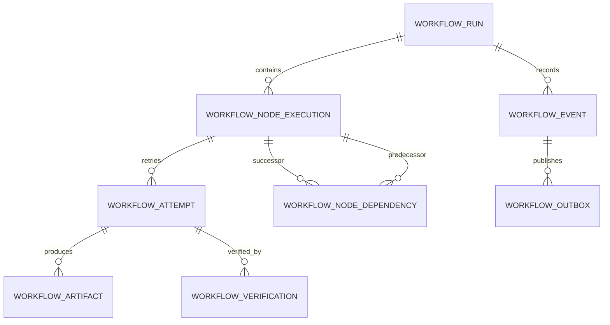
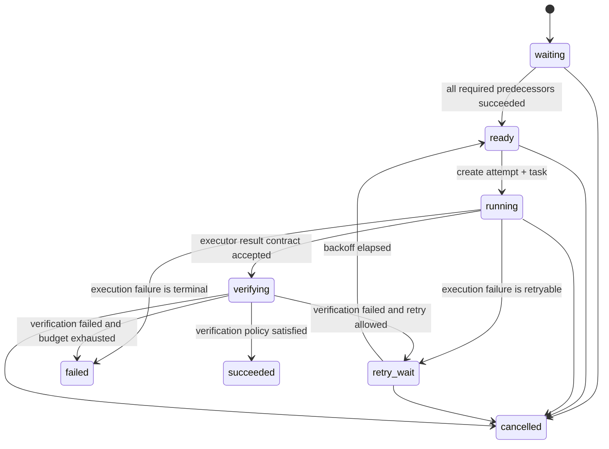
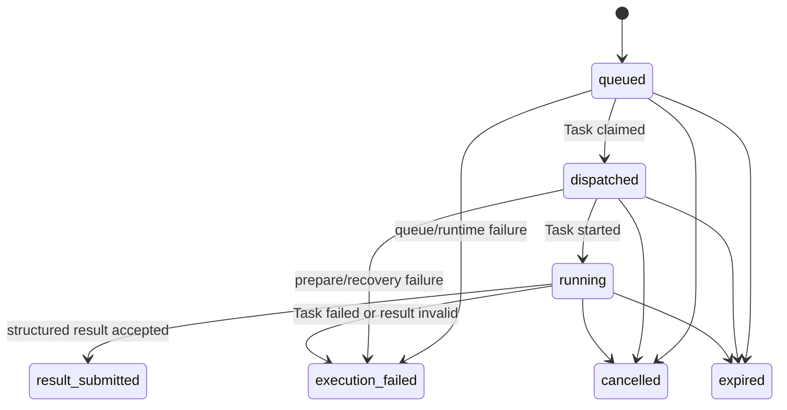
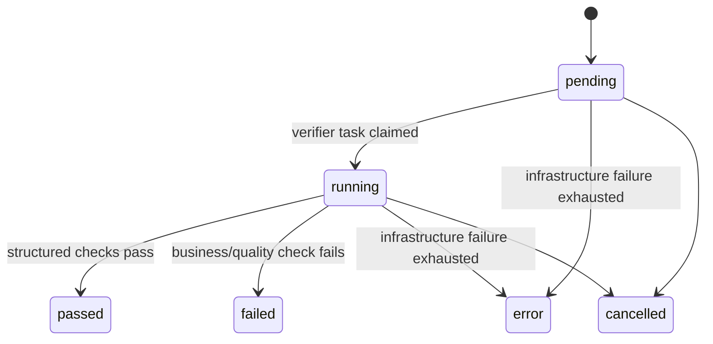

# 03｜详细技术方案

## 1. 核心聚合模型



### 1.1 `workflow_run`

一份 Studio Plan 的单次不可变执行快照。

建议字段：

| 字段 | 作用 |
|---|---|
| `id`, `workspace_id` | 身份和租户边界 |
| `root_issue_id` | 可选的人类协作 Root 投影 |
| `status` | `pending/running/succeeded/failed/cancelled` |
| `revision` | Run 级单调版本，也是事件序列来源 |
| `definition_key/version/digest` | 记录 Studio 定义版本，不依赖在线作者态 |
| `plan_snapshot` | 不可变 Node/Edge/输入摘要；用于审计和重放 |
| `policy_snapshot` | 本次 Run 使用的通用 retry/verification/cancel policy |
| `idempotency_key` | 防止创建请求重试生成两个 Run |
| `created_at/started_at/completed_at` | 生命周期 |

`plan_snapshot` 用来冻结输入，但 Node 当前状态不能只写在 JSON 中；状态必须规范化到 Node 表。

### 1.2 `workflow_node_execution`

一个 Run 内一个逻辑 Node 的唯一权威状态。

| 字段 | 作用 |
|---|---|
| `run_id`, `node_key` | Run 内稳定业务键；唯一 |
| `issue_id` | 可选 Issue 投影链接 |
| `node_kind` | 通用类型，如 `agent_task/human_gate/external_check`；不硬编码 coding/review |
| `status` | Node 状态机 |
| `revision` | Node CAS 版本 |
| `fence_token` | 每次生成新 Attempt 时单调递增 |
| `active_attempt_id` | 唯一允许影响当前 Node 的 Attempt |
| `attempt_count` | 已生成尝试数 |
| `executor_spec` | Agent/Runtime 路由快照；由 Studio 生成，Runtime 执行 |
| `retry_policy` | 最大次数、可重试 failure code、backoff |
| `verification_policy` | required verifier、是否要求独立主体、artifact 规则 |
| `input_spec/input_digest` | 本次 Node 的冻结输入和摘要 |
| `ready_at/started_at/completed_at` | 生命周期 |
| `failure_code/failure_detail` | 结构化终态原因；detail 需脱敏和限长 |

### 1.3 `workflow_node_dependency`

规范化 DAG 边。

V1 仅支持最小且确定的条件：

```text
required_success
```

即所有 required predecessor 都 `succeeded`，successor 才能 `waiting → ready`。

后续可增加 `any_success/all_terminal/manual_signal`，但不在 PoC 中提前泛化。

字段：`run_id/predecessor_node_id/successor_node_id/condition/created_at`，并对三元组做唯一约束。

### 1.4 `workflow_attempt`

一个 Node 的一次实际执行尝试。

| 字段 | 作用 |
|---|---|
| `run_id/node_id/attempt_no` | lineage；Node 内 attempt_no 唯一 |
| `fence_token` | 创建时复制 Node 当前 fence |
| `task_id` | 绑定现有 `agent_task_queue.id`；唯一 |
| `executor_id/runtime_id` | 执行身份快照，便于审计 |
| `status` | `queued/dispatched/running/result_submitted/execution_failed/expired/cancelled` |
| `result_payload/result_digest` | 结构化结果与 canonical digest |
| `failure_code/failure_detail` | 使用 Multica failure taxonomy 并补充 contract 类错误 |
| `deadline_at/next_retry_at` | policy 计算后的期限 |
| `created_at/started_at/completed_at` | 生命周期 |

`result_submitted` 只表示 executor 完成并提交了合法结构，不表示 Node 成功。

### 1.5 `workflow_artifact`

Attempt 产生的不可变 ArtifactManifest。

| 字段 | 作用 |
|---|---|
| `attempt_id/node_id/run_id` | 归属 |
| `kind` | `git_commit/test_report/deployment/db_check/ui_evidence/...` |
| `uri` | 可寻址引用；禁止写入带签名 query、token 或本地临时路径作为最终证据 |
| `digest` | 内容或 canonical manifest digest |
| `manifest` | 结构化元数据、检查项、来源 |
| `created_by_task_id/principal` | 谁提交 |
| `created_at` | 不可变创建时间 |

Artifact 只允许 insert，不提供 update。纠错产生新 Artifact，并由新 Result/Verification 引用。

### 1.6 `workflow_verification`

一次独立验证尝试。

| 字段 | 作用 |
|---|---|
| `attempt_id/node_id/run_id` | 被验证对象 |
| `verification_no` | 同一 Attempt 可多次验证 |
| `verifier_kind/verifier_id` | Agent、系统检查、人工或外部 CI |
| `verification_task_id` | 若由 Agent 执行，绑定 Task Queue |
| `status` | `pending/running/passed/failed/error/cancelled` |
| `input_artifact_digest` | 锁定验证输入，防止验证后 Artifact 被替换 |
| `result` | checks、失败项、日志引用、结论 |
| `idempotency_key` | callback 重试去重 |
| `started_at/completed_at` | 生命周期 |

如果 policy 要求独立验证，服务端必须校验 `verifier_id != attempt.executor_id`，而不是靠 Prompt 约定。

### 1.7 `workflow_event`

append-only 审计事实。每次 Reducer 成功命令至少写一条 Event。

建议字段：`run_id/sequence/aggregate_type/aggregate_id/event_type/from_state/to_state/aggregate_revision/actor_type/actor_id/attempt_id/verification_id/idempotency_key/payload/created_at`。

`sequence` 来自同一事务中递增后的 `workflow_run.revision`，从而保证 Run 内全序。

### 1.8 `workflow_outbox`

状态提交后的 durable side-effect intent。

字段包括：`event_id/run_id/topic/event_key/payload/status/available_at/lease_token/lease_expires_at/attempts/last_error/published_at`。

发布语义是 at-least-once；消费者必须以 `event_id` 幂等。

## 2. 数据库约束与迁移规则

当前仓库规则禁止新增 foreign key 和 cascade，因此设计遵守：

1. 新表之间不添加 `REFERENCES`。
2. 每张 Workflow 表都显式携带 `workspace_id NOT NULL`，即使它可从 Run 推导；所有查询把它作为租户 guard 和清理键，避免重演 `agent_task_queue` 缺少 workspace_id 后必须跨表发现归属的复杂度。
3. 每个写命令在 service 中校验 workspace、run、node、attempt 的关系。
4. Workspace/Run 删除在应用事务中显式按固定顺序清理。
5. 更新 `workspace_delete` manifest 和相关测试，确保新表不会遗留。
6. 每个索引使用 `CREATE [UNIQUE] INDEX CONCURRENTLY`，每个索引单独一个 migration 文件。
7. 新表创建 migration 不内联创建普通/唯一索引；`id` 先 `NOT NULL`，再用单独 migration 创建 concurrent unique index，并在后续 migration 用该索引附加 primary-key constraint。
8. 数据状态用 `CHECK` 约束防御 direct SQL，但业务转移合法性仍由 Reducer 管理。

建议唯一约束/索引：

```text
workflow_run(workspace_id, idempotency_key) WHERE idempotency_key IS NOT NULL
workflow_node_execution(run_id, node_key)
workflow_node_dependency(run_id, predecessor_node_id, successor_node_id)
workflow_attempt(node_id, attempt_no)
workflow_attempt(task_id) WHERE task_id IS NOT NULL
workflow_artifact(attempt_id, digest)
workflow_verification(verification_task_id) WHERE verification_task_id IS NOT NULL
workflow_verification(run_id, idempotency_key) WHERE idempotency_key IS NOT NULL
workflow_event(run_id, sequence)
workflow_event(run_id, idempotency_key) WHERE idempotency_key IS NOT NULL
workflow_outbox(event_id, topic)
workflow_outbox(status, available_at)
```

## 3. 状态机

### 3.1 Node 状态机



初始无前驱 Node 在 Run 启动事务中直接进入 `ready`。Node 不能从 `succeeded/failed/cancelled` 返回非终态；重新执行要新建 Run，或显式创建 remediation Node/child Run。

### 3.2 Attempt 状态机



Attempt terminal 不等于 Node terminal。`result_submitted` 会触发 Verification，而不是直接成功。

### 3.3 Verification 状态机



`failed` 表示证据不通过；`error` 表示验证过程没有得到可信结论。两者都不能使 Node 成功，但 retry policy 可以不同。

## 4. Reducer 命令模型

所有状态变化通过服务端 command 执行：

```go
type WorkflowCommand struct {
    RunID          UUID
    AggregateID    UUID
    ExpectedState  string
    ExpectedRev    int64
    IdempotencyKey string
    Actor          Principal
    Payload        any
}
```

公共写入口不接收 `new_state`。调用者表达事实或意图，Reducer 根据当前状态和 policy 决定结果：

| Command | 调用者表达的事实/意图 | Reducer 决定 |
|---|---|---|
| `CreateRun` | 执行这份 plan snapshot | 校验 DAG、创建初始 ready Node |
| `DispatchReadyNode` | 尝试领取一个 ready Node | 是否生成 Attempt/Task |
| `AcceptTaskDispatched` | 绑定 Task 已被领取 | Attempt 是否仍是 active |
| `AcceptTaskStarted` | 绑定 Task 已开始 | Attempt 是否可进入 running |
| `AcceptAttemptResult` | Task 返回结构化结果和 artifacts | contract 是否有效、是否进入 verifying |
| `AcceptAttemptFailure` | Task 返回 failure reason | retry_wait 还是 failed |
| `AcceptVerificationResult` | verifier 返回 checks | Node succeeded、retry_wait 或 failed |
| `CancelRun/Node` | 人工取消意图 | 哪些 active Task/Attempt 需要取消 |
| `ApproveHumanGate` | 某成员批准 | gate policy 是否满足 |

## 5. 并发控制

### 5.1 per-run 事务锁

每条会改变 Run/Node 的命令先获得：

```sql
SELECT pg_advisory_xact_lock(hashtextextended(@run_id::text, 0));
```

它提供：

- 同一 Run 内命令全序；
- 两个前驱同时完成时不会出现双方都看不到对方提交、后继永远未释放；
- Run revision/event sequence 单调；
- 不同 Run 仍可并行。

这是“逻辑单 Reducer”，不是依赖一台单例 Controller。

### 5.2 Node revision CAS

即使持有 per-run lock，也保留 expected revision 作为 API 级 stale read 防线：

```sql
UPDATE workflow_node_execution
SET status = @to_state,
    revision = revision + 1,
    updated_at = now()
WHERE id = @node_id
  AND run_id = @run_id
  AND status = @from_state
  AND revision = @expected_revision
RETURNING *;
```

零行更新返回 `409 stale_revision`，不会“帮调用者猜”最新状态。

### 5.3 Attempt fencing

创建 Attempt 时：

```text
node.fence_token += 1
attempt.fence_token = node.fence_token
node.active_attempt_id = attempt.id
```

接受 Attempt Result/Failure 时必须同时满足：

```text
node.active_attempt_id == attempt.id
node.fence_token == attempt.fence_token
attempt.task_id == authenticated_task_id
```

旧 Attempt 晚到时：

- 可以记录一条 `stale_attempt_result_rejected` Event；
- 可以保留它已经注册的 Artifact 供诊断；
- 不能修改 Node、释放依赖或改变 Run。

### 5.4 锁顺序

所有 Workflow 路径统一：

```text
run advisory lock
→ node row
→ attempt / verification row
→ agent_task_queue row or task creation owner fence
→ event / outbox
```

Task terminal API 在进入事务前先只读解析 `task_id → workflow run` 绑定；若有绑定，先拿 run lock，再做 Task terminal CAS。Legacy Task 沿用原路径。

## 6. 关键事务

### 6.1 创建 Run

Service 先校验：

- workspace 与调用者权限；
- node_key 唯一；
- edge 两端都存在；
- 无自环、无环；
- executor/verification policy 可解析；
- definition/plan digest 与 canonical JSON 匹配；
- idempotency key 是否已有 winner。

同一事务：

```text
INSERT workflow_run
INSERT workflow_node_execution
INSERT workflow_node_dependency
UPDATE zero-indegree nodes waiting → ready
UPDATE run pending → running
INSERT workflow_event(run_created, nodes_ready)
INSERT workflow_outbox
COMMIT
```

### 6.2 派发 Ready Node

派发分成“事务外准备”和“事务内提交”。Agent/Runtime 选择和可选 connected-app overlay 可能访问外部服务，必须先生成带 digest 的 dispatch plan；per-run lock 内只允许数据库读写。事务内重新校验 agent/runtime 等数据库事实，准备失败则 Node 保持 `ready`。

```text
BEGIN
lock run
SELECT ready node FOR UPDATE
CAS ready → running; revision++; fence++
INSERT workflow_attempt(status=queued, fence=current)
INSERT agent_task_queue(max_attempts=1, workflow context)
UPDATE attempt.task_id
INSERT event + outbox(task wake, realtime, projection)
COMMIT
```

`max_attempts=1` 是关键：Workflow-owned Task 不走 TaskService 自己的自动 retry；否则一个基础设施失败可能同时产生 Task retry child 和 Workflow Attempt retry。

Task create 必须复用现有 attribution、owner-row fence、runtime overlay 和 queue invariants。实现方式是给 TaskService 增加 transaction-bound create seam，接收事务外已经准备并校验过的 task plan，而不是在 WorkflowService 复制一份 Task INSERT，也不是在数据库锁内调用外部 overlay 服务。

### 6.3 Task claim / start

`ClaimTask` 已经在事务中执行。对绑定 Attempt 追加幂等 hook：

```text
Task queued → dispatched
Attempt queued → dispatched
event + outbox
```

`StartTask` 改为事务包装：

```text
Task dispatched → running
Attempt dispatched → running
event + outbox
```

Node 在创建 Attempt 时已经进入 `running`，因此排队等待也属于 Node 的执行期；Attempt 提供更精确的 queue/dispatch/run 视图。

### 6.4 executor 完成

Workflow Task 的 completion payload 必须是结构化 envelope，例如：

```json
{
  "schema": "workflow-attempt-result/v1",
  "attempt_id": "...",
  "fence_token": 7,
  "outcome": "RESULT_SUBMITTED",
  "summary": "...",
  "artifact_digests": ["sha256:..."],
  "checks": [
    {"name": "unit_test", "status": "passed", "artifact_digest": "sha256:..."}
  ]
}
```

`CompleteTask` 同一事务内：

```text
lock run
Task running → completed
校验 schema、task_id、attempt_id、fence、active_attempt
校验 artifact 均已存在且 digest 匹配
Attempt running → result_submitted
Node running → verifying
创建 verification row / verifier task
event + outbox
COMMIT
```

如果 payload 缺失、格式错误或 Artifact 不完整：

```text
Task 仍可 completed（进程事实）
Attempt → execution_failed(invalid_result_contract)
Node → retry_wait 或 failed（按 policy）
```

这正面解决“Task completed 但没有合法结果”的历史故障。

### 6.5 executor 失败

`FailTask` 同一事务内：

```text
lock run
Task → failed（沿用 failure_reason taxonomy）
Attempt → execution_failed
if retryable && attempt_count < budget:
    Node → retry_wait
    set next_retry_at
else:
    Node → failed
run rollup
event + outbox
COMMIT
```

backoff 到期由 durable dispatcher 通过同一 Reducer 执行 `retry_wait → ready → new Attempt`。旧 Attempt 保持终态，新的 fence 使旧回写失效。

### 6.6 Verification 完成与依赖释放

Verifier Task 也使用结构化 envelope：

```json
{
  "schema": "workflow-verification-result/v1",
  "verification_id": "...",
  "input_artifact_digest": "sha256:...",
  "verdict": "PASS",
  "checks": [
    {"name": "tests", "status": "passed", "evidence_uri": "..."},
    {"name": "delivery", "status": "passed", "evidence_uri": "..."}
  ]
}
```

同一事务：

```text
lock run
校验 verification task 身份、input digest、独立 verifier policy
Verification running → passed/failed/error
if policy satisfied:
    Node verifying → succeeded
    找到当前 Node 的 outgoing successors
    对每个 waiting successor：
        若所有 required predecessors succeeded，则 CAS waiting → ready
    若所有 Node terminal，计算 Run succeeded/failed/cancelled
else if retry allowed:
    Node verifying → retry_wait
else:
    Node verifying → failed
INSERT ordered events
INSERT outbox rows
COMMIT
```

依赖释放不维护一个容易漂移的 `remaining_dependency_count` 作为唯一事实。V1 在 per-run lock 下基于 edge + predecessor state 求值；规模扩大后可以增加可校验的计数缓存，但关系真相仍在边和 Node 状态。

### 6.7 投影

Outbox consumer 把 Runtime 事实投影到：

- Issue status；
- Issue metadata 中的只读 link/snapshot；
- 人类可读 Comment；
- WebSocket/React Query cache；
- metrics/audit sink。

投影失败不回滚 Workflow 状态。consumer 重试；reconciler 可以比较 `projection_revision` 与 Run/Node revision 补齐。

## 7. Task Queue 集成边界

### 7.1 两套状态分别负责什么

| 问题 | 负责对象 |
|---|---|
| Agent Task 有没有排队、被哪台 Runtime claim、进程是否结束 | `agent_task_queue` |
| 这个 Task 属于哪个逻辑尝试 | `workflow_attempt.task_id` |
| 当前 Node 还接受不接受这个 Attempt | `active_attempt_id + fence_token` |
| 失败后要不要重试 | Workflow node retry policy |
| 结果是否足以完成 Node | Verification policy |

### 7.2 不新增第二套运行 lease

V1 复用：

- pre-start：`prepare_lease_expires_at`；
- running：Runtime heartbeat/liveness；
- daemon restart：`RecoverOrphanedTasksForRuntime`；
- timeout/offline：现有 sweeper 和 failure taxonomy。

Workflow 只保存 `deadline_at` 和 fence，不用另一套 heartbeat 对同一 Task 给出冲突判定。

如果未来支持不经过 `agent_task_queue` 的外部 executor，再为该 executor kind 引入专门 lease provider；不能让同一个 Attempt 同时被两套 lease 判定。

### 7.3 Retry 只有一个 owner

```text
Legacy Task              → 继续使用 TaskService auto-retry
Workflow-owned Task      → max_attempts=1；Workflow retry policy 创建新 Attempt
Verification Task        → Verification policy 创建新 verification attempt
```

## 8. Outbox 与后台任务

### 8.1 Outbox worker

使用 Multica 已有 durable webhook worker 的风格：

```text
SELECT available row FOR UPDATE SKIP LOCKED
→ set lease_token / lease_expires_at / attempts++
→ publish
→ CAS lease_token mark published
```

发布失败按指数 backoff 更新 `available_at`。lease 过期后其他实例可重领。

`event_id` 是消费者幂等键。不能承诺 exactly-once 网络投递，只承诺 exactly-once state transition + at-least-once event delivery。

### 8.2 Reconciler

Reconciler 只检查结构化不变量，不解析自然语言：

- running Node 是否存在 active Attempt；
- active Attempt 是否绑定 Task；
- Task terminal 是否已结算 Attempt；
- verifying Node 是否存在未完成 Verification；
- waiting Node 的依赖是否已经满足；
- terminal Node 后 Run rollup 是否正确；
- Outbox 是否长期 pending/leased；
- Issue projection revision 是否落后。

修复必须重新调用 Reducer command，不能 direct SQL 跳过 event/outbox。

## 9. API 与权限

### 9.1 人类/控制面 API

| API | 权限 | 说明 |
|---|---|---|
| `POST /workflow-runs` | workspace member/controller | 创建 Run，必须带 Idempotency-Key |
| `GET /workflow-runs/{id}` | workspace viewer | 读取 Run graph 与状态 |
| `POST /workflow-runs/{id}/cancel` | authorized member/controller | 取消，不接收任意 new_state |
| `POST /workflow-nodes/{id}/approve` | human gate approver | 记录明确审批事实 |
| `POST /workflow-nodes/{id}/retry` | authorized member | 人工创建新 Attempt，仍经过 policy/fence |

### 9.2 Task-scoped API

| API | 身份 | 约束 |
|---|---|---|
| `POST /workflow-attempts/{id}/artifacts` | Task token | task_id、attempt、fence 必须匹配 |
| Task complete result envelope | Daemon/Task token | 只提交结果，不指定 Node 新状态 |
| Verification complete envelope | Verifier Task token | verifier、input digest、verification id 匹配 |

API 响应解析遵守 Multica 现有 zod/compatibility 规则；错误使用结构化 code：`stale_revision/stale_fence/invalid_contract/policy_denied/idempotency_conflict`。

### 9.3 写权限隔离

- Agent 对 Workflow 表无通用 CRUD。
- Handler 从 Task token 解析可信 task id 和 workspace，不接受 body 伪造身份。
- Artifact URI 和 payload 做 secret/path redaction、大小限制和 schema validation。
- Comment 和 metadata 更新不能反向触发 authoritative transition。

## 10. 不变量

实现和测试至少固定以下不变量：

1. 每个 Run 的 `node_key` 唯一。
2. 每个 Node 最多一个 `active_attempt_id`。
3. Attempt 的 fence 创建后不可变。
4. Node 只接受 active Attempt 且 fence 相等的结果。
5. Node `succeeded` 必须存在满足 policy 的 `passed` Verification。
6. Verification 的 input digest 必须等于当前 Attempt Artifact 集合 digest。
7. Workflow-owned Task 不由 TaskService 创建自动 retry child。
8. successor `ready` 时所有 required predecessor 都是 `succeeded`。
9. Run `succeeded` 时所有 required Node 都是 `succeeded`。
10. 每个成功状态迁移都有同事务 Event。
11. 每个需要外部副作用的 Event 都有同事务 Outbox。
12. 每个 idempotency key 对同一 Run 只产生一个成功命令结果。
13. workspace 不匹配的 ID 组合一律 fail closed。
14. Issue/Comment/metadata 的任何写入都不能直接改变 Workflow 权威状态。

## 11. 故障注入验收

| Case | 注入方式 | 必须结果 |
|---|---|---|
| 双 Controller | 两个事务用同一 revision 推进 Node | 只有一个成功，另一个 409/stale |
| 旧 Attempt 晚到 | Attempt-1 超时后创建 Attempt-2，再提交 Attempt-1 PASS | 记录 stale event，但 Node 不变 |
| Task 假完成 | Task completed，payload 是普通文本或限流信息 | Attempt contract failure；Node 不进入 verifying/succeeded |
| Artifact 被替换 | Verification 引用与 Attempt 不同 digest | Verification 拒绝，Node 不成功 |
| executor 自验 | executor_id 与 verifier_id 相同，policy 要求独立 | policy_denied |
| daemon 重启 | running Task 被 orphan recovery 标记失败 | Attempt 结构化失败，按 Workflow policy 唯一重试 |
| 双前驱并发完成 | A、B 同时 PASS，C 依赖 A+B | C 最终且只进入一次 ready |
| 重复 callback | 同 idempotency key 重放 result/verification | 返回相同事实，无第二次迁移 |
| 状态提交后进程崩溃 | commit 后、publish 前 kill server | Outbox worker 恢复发布 |
| Projector 失败 | Issue/Comment 写失败 | Workflow 状态不回滚，投影后续补齐 |
| Retry 双重触发 | Task failure 同时运行 Task sweeper 和 Workflow reducer | 只创建一个新 Attempt，无 Task auto-retry child |
| Run 取消与完成竞争 | cancel 与 verification PASS 并发 | per-run 序列产生一个合法终态，可审计 |

## 12. 可观测性

### 12.1 Metrics

- `workflow_command_total{type,outcome}`
- `workflow_node_transition_total{from,to}`
- `workflow_cas_conflict_total`
- `workflow_stale_fence_rejection_total`
- `workflow_attempt_total{outcome,failure_code}`
- `workflow_verification_total{verdict,verifier_kind}`
- `workflow_node_latency_seconds{node_kind}`
- `workflow_outbox_lag_seconds`
- `workflow_outbox_retry_total`
- `workflow_projection_lag_revision`
- `workflow_reconcile_repair_total{invariant}`

### 12.2 日志与追踪键

每条日志至少包含：`workspace_id/run_id/node_id/attempt_id/task_id/verification_id/revision/fence_token/event_id` 中适用字段；不得输出 Artifact 内容、token、带签名 URL 或完整 result payload。

### 12.3 运维读模型

CLI/API 应能直接回答：

```text
为什么这个 Node 现在是 verifying？
哪个 Task 产生了当前 Attempt？
当前 fence 是多少，旧 Attempt 为什么被拒绝？
Verification 检查了哪组 Artifact digest？
后继为什么尚未 ready？
Outbox 是否发布，Issue 投影是否落后？
```

如果还需要从评论文本人工拼答案，说明结构化模型没有完成。

## 13. 最小 PoC 实现边界

第一版只实现：

- 单 Workspace、本地 self-host；
- 手工提交三节点 DAG：A Coding → B Review → C Verify；
- `agent_task` Node kind；
- required_success edge；
- 单 verifier policy；
- CAS、fence、Artifact digest、Verification、dependency release；
- Task complete/fail transaction hook；
- Event/Outbox 和一个 CLI inspect；
- 上述故障注入中的核心 6～8 个 Case。

第一版不做 UI、不做复杂 Planner、不做多种 edge condition、不做控制包发布体系。PoC 的目标是证明“外围可靠性胶水可以被底层事务语义替代”，不是复制整个 Studio。
