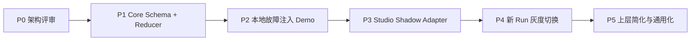

# 04｜演进与落地路线

## 1. 演进目标

不是一次性替换 Workflow Studio，而是依次证明四件事：

1. Multica 核心可以表达结构化 Run/Node/Attempt。
2. 并发、重启、重复投递和旧 Attempt 晚到不会破坏状态。
3. Artifact + independent Verification 能阻止“格式正确的假 PASS”。
4. 新 Runtime 可以逐步接管新 Run，而不把线上旧 Run 迁成双权威。

## 2. 阶段路线



### P0｜架构评审

本轮文档即 P0 产物。

进入实现前必须确认：

- Studio/Multica 责任边界；
- NodeExecution 的唯一权威地位；
- Task retry 与 Workflow retry 的唯一 owner；
- Verification 独立性；
- per-run lock + revision CAS + fence 的组合；
- 迁移期间不建立双权威。

退出条件：关键开放问题有明确结论，Schema 状态枚举不再大幅摇摆。

### P1｜Core Schema + Reducer

只实现后端，不接 Studio UI。

工作包：

1. migrations、sqlc queries 和 cleanup；
2. `WorkflowRuntimeService` 和命令模型；
3. CreateRun、Dispatch、Attempt settlement、Verification settlement；
4. dependency release、run rollup；
5. Event/Outbox；
6. CLI create/inspect；
7. 单元/数据库集成测试。

退出条件：不依赖 Agent/LLM，用 fake task/result 就能跑通 A → B → C。

### P2｜本地故障注入 Demo

固定 Demo DAG：

```text
A Coding
  ↓
B Review
  ↓
C Verify
```

必须演示：

1. 两个 Controller 并发推进，只有一个 CAS winner；
2. Attempt-1 超时后 Attempt-2 生效，Attempt-1 晚到 PASS 被 fence 拒绝；
3. Task completed 但 result contract 无效，Node 不推进；
4. executor 提交格式合法假 PASS，independent verification FAIL，Node 不成功；
5. daemon/reducer/outbox worker 分别在关键窗口 kill 后可以恢复；
6. Verification PASS 后下一 Node 自动 ready；
7. 重复 result/verification callback 幂等；
8. Workflow retry 与 Task retry 不会各生成一个 child。

退出条件：自动化测试可重复跑，Demo 不依赖人工修数据库。

### P3｜Studio Shadow Adapter

Studio 仍是 Legacy 权威，新 Runtime 只接收影子事件并比较结果。

Shadow 输入：

- Legacy Run/Root/Leaf 映射；
- phase/gate/generation；
- Task lifecycle；
- result comment/callback；
- Shadow Artifact/Verification（若可获得）。

Shadow 输出：

- 如果按新 Reducer 运行，Node 会处于什么状态；
- Legacy 与 Runtime 的状态差异；
- stale/duplicate/invalid result 数量；
- 依赖释放时延；
- false-complete 候选；
- reconcile repair 数量。

约束：

- Shadow 不写 Source Issue 正式状态；
- Shadow 不派发第二份正式业务 Task；
- Shadow 失败不能影响 Legacy；
- 比较数据按 definition/controller 版本分组。

退出门槛建议：

- 连续一段样本期无未知状态差异；
- 已知差异均能归因于明确 policy；
- stale fence/duplicate callback case 被稳定拦截；
- Outbox、projection、reconcile 无持续积压；
- rollback 演练完成。

### P4｜新 Run 灰度切换

切换单位是 **新 Run**，不是旧 Issue，也不是全 Workspace 一刀切。

路由示例：

```text
workflow_runtime_mode = legacy | shadow | authoritative
```

规则：

- 已启动 Legacy Run 继续由 Legacy Controller 完成；
- 新 Run 在创建时固定 runtime mode，运行中不自动切换；
- authoritative Run 由 NodeExecution 推进，Issue/metadata 只是投影；
- Legacy Controller 看到 authoritative link 后必须跳过写入；
- 回滚仅影响尚未创建的新 Run，或先 freeze 当前 Run 再做人工迁移决策。

推荐灰度顺序：

1. 单一 Demo/测试 Workspace；
2. 单一、短 DAG、低风险 Workflow；
3. 有独立 verifier 的研发链；
4. 多节点并行 DAG；
5. remediation/human gate；
6. 更广泛场景。

### P5｜上层简化与通用化

当 authoritative 运行稳定后，逐步删除或降级：

- callback_pending/result_comment_id 多字段 envelope；
- dispatch_key 作为状态权威；
- Comment 标题查重承担机器协议；
- dependency 全量轮询；
- `/tmp` 单 Controller lease；
- 正常路径上的 recovery_queue；
- Root 仅根据 Issue 终态收口的逻辑。

保留：

- 人类可读评论；
- Issue/metadata link；
- Health/Reconciler，但职责变为结构化不变量检查；
- Supervisor/Bad Case，用于发现新类别问题和改进 policy。

## 3. 实现切片

每个切片都应该能独立测试，避免一次大改 5900 行的 TaskService。

| Slice | 内容 | 主要验证 |
|---|---|---|
| S1 | Schema + CRUD + DAG validation | tenant、环检测、唯一键、cleanup |
| S2 | per-run lock + Node CAS + Event | 双写竞争只有一个 winner |
| S3 | fence + Attempt lineage | 旧 Attempt 晚到不推进 |
| S4 | Task transaction-bound create | Attempt/Task 无孤儿窗口 |
| S5 | Task start/complete/fail hook | Task 与 Attempt 同事务结算 |
| S6 | Artifact + Verification | 假 PASS 被拦截、digest 锁定 |
| S7 | dependency release + run rollup | 并发前驱完成不漏释放 |
| S8 | Outbox + projection | commit/publish crash recovery |
| S9 | Reconciler + metrics + CLI inspect | 可诊断、可收敛 |
| S10 | Studio Shadow adapter | 新旧差异可观测 |

## 4. 测试策略

### 4.1 Reducer 单元测试

- 合法/非法状态转移表驱动测试；
- retry/verification policy；
- run rollup；
- structured failure code；
- idempotency response。

### 4.2 PostgreSQL 集成测试

- 两连接并发 CAS；
- per-run advisory lock 顺序；
- `FOR UPDATE SKIP LOCKED`；
- transaction rollback 不留 event/outbox/task；
- unique conflict winner recovery；
- workspace cleanup；
- concurrent predecessor completion。

### 4.3 TaskService 回归

- Legacy Task retry 行为不变；
- Workflow-owned Task `max_attempts=1`；
- CompleteTask/FailTask 幂等行为不变；
- chat/autopilot task 不会误进入 Workflow hook；
- orphan recovery 能结算 Workflow Attempt；
- rolling deploy 中旧 daemon 的 result contract 不会误推进。

### 4.4 故障注入

在这些事务边界 kill/restart：

```text
Run/Node 写入前
Node CAS 后、Attempt 创建前
Attempt 创建后、Task 创建前
Task terminal 后、Node settlement 前
Node success 后、Outbox publish 前
Outbox publish 后、mark published 前
Issue projection 写到一半
```

期望是事务回滚，或 durable state/Outbox 可继续；不能靠手工改 metadata 恢复。

### 4.5 验证命令

实现阶段按风险从窄到宽：

```bash
cd server && go test ./internal/service -run Workflow
cd server && go test ./internal/handler -run Workflow
make sqlc
make test
make check
```

本轮只有文档，不宣称这些实现测试已经运行。

## 5. 数据迁移策略

### 5.1 不回填旧 Run 为权威

旧 metadata/Comment 历史无法无歧义还原 Attempt、Artifact 和 Verification。强行回填会制造“看起来结构化、实际仍是推断”的伪权威。

做法：

- 旧 Run 保持 Legacy；
- 可生成只读 imported snapshot，标记 `authority=legacy_import`；
- 新 Runtime 只对创建时就选定 `authoritative` 的 Run 承担状态裁决。

### 5.2 Projection 兼容

authoritative Run 仍更新 Issue，便于现有 UI 使用：

| Node/Run 状态 | 建议 Issue 投影 |
|---|---|
| waiting | backlog/blocked（按 UI 语义） |
| ready | todo |
| running/verifying/retry_wait | in_progress 或 in_review |
| succeeded | done |
| failed | blocked |
| cancelled | cancelled |

映射必须带 `projection_revision`，并明确是粗粒度展示，不允许 Legacy callback 因看到投影变化而二次推进。

## 6. 回滚与恢复

### 6.1 发布回滚

数据库 migration 采用 expand/contract：

1. expand：新表、新代码默认关闭；
2. shadow：只写新表，不影响正式 Run；
3. authoritative：仅新 Run 打开；
4. contract：稳定后再删除 Legacy 胶水。

代码回滚必须保留新表读取能力，旧 binary 若完全不认识 authoritative Run，不得接管其写入。

### 6.2 单 Run 紧急处理

```text
freeze dispatch
→ 等 active task 到安全点或明确 cancel
→ inspect Event/Attempt/Verification/Outbox
→ 用受审计的 admin command 修复/终止
→ unfreeze 或创建 replacement Run
```

禁止通过 direct SQL 或改 Issue metadata 伪造 Node 状态。

### 6.3 Outbox/Projection 故障

Workflow 权威继续运行；如果用户可见性不足，可临时 freeze 新派发，但不回滚已验证状态。恢复 publisher/projector 后按 Event sequence 补齐。

## 7. 风险与缓解

| 风险 | 影响 | 缓解 |
|---|---|---|
| TaskService 耦合过深 | 回归面大 | transaction hook + 小切片 + Legacy no-op path |
| per-run lock 争用 | 大 Run 转移延迟 | 锁只覆盖 DB 事务，不在锁内调用网络/LLM；不同 Run 并行 |
| JSON policy 变成新 metadata | policy 漂移、难校验 | versioned schema + canonical digest + 关键状态规范化列 |
| Verification 只是第二个会说谎的 Agent | 仍可能假 PASS | 独立 principal、artifact digest、机器检查、多人/人工 gate 可组合 |
| Outbox 积压 | UI/Task wake 延迟 | polling 兜底、lag metrics、lease/retry、dead-letter 诊断 |
| 新旧 Controller 互相写 | 状态分叉 | Run 创建时固定 authority；Legacy 对 authoritative link fail closed |
| Workflow retry 与 Task retry 重复 | 双执行/双副作用 | Workflow Task max_attempts=1 + invariant test |
| 无 FK 导致孤儿记录 | 存储和租户风险 | service validation、显式 cleanup、workspace delete manifest tests |
| rolling deploy 新旧 daemon payload 不兼容 | invalid contract | task context 标识 schema，server fail closed；authoritative feature gate 检查 daemon capability |

## 8. PoC 验收定义

PoC 通过不是“页面能看到三个框”，而是满足：

- 数据库中可直接查询完整 Run/Node/Attempt/Verification lineage；
- 任意重复和乱序请求不产生错误状态；
- Task completed 无证据时 fail closed；
- independent Verification 是 Node succeeded 的必要条件；
- daemon/server/outbox 崩溃后自动收敛；
- dependency release 不需要等待五分钟扫描；
- Issue/Comment 即使投影失败，Workflow 权威仍正确；
- 每个结论都能从 Event 解释“谁、何时、基于什么 revision/evidence 做出”。

达到这些门槛后，再讨论 UI、完整 Studio 接入和开源 PR 范围。
